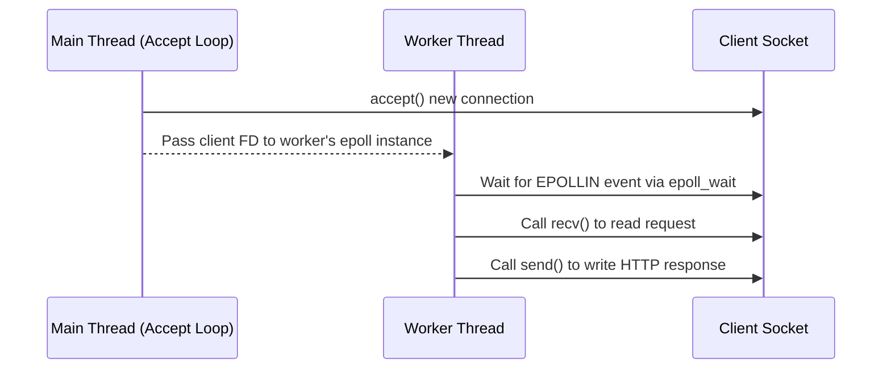
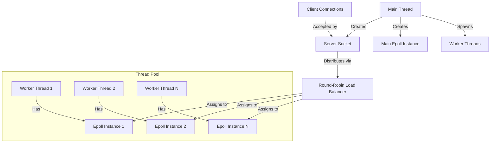
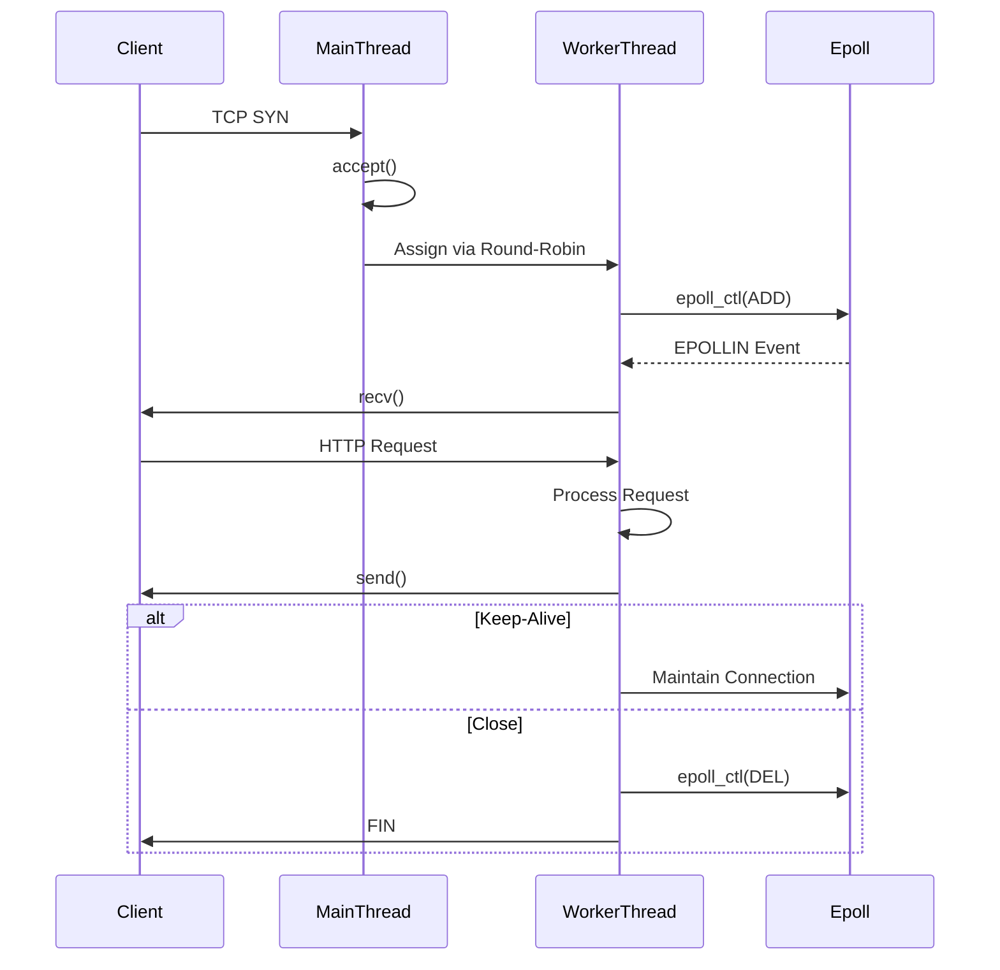
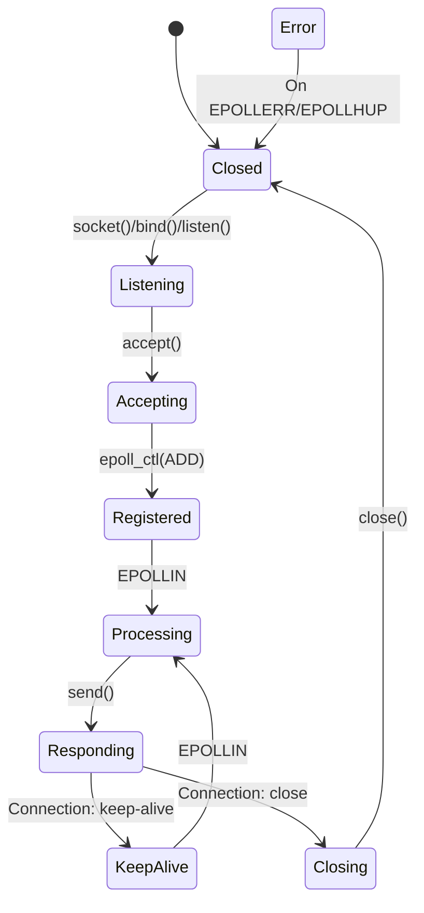

## 3. Connection Acceptance Sequence Diagram

This sequence diagram shows the interaction between the main thread, a worker thread, and a client socket during connection acceptance and processing.

---

---

---

---

---
